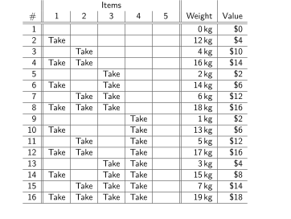
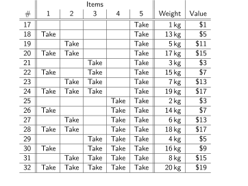

import AlignVarLatex from "@components/AlignVarLatex";
import DisplayLatex from "@components/DisplayLatex";
import Eqref from "@components/Eqref";
import GatherVarLatex from "@components/GatherVarLatex";
import Latex from "@components/Latex";

import Centered from "@components/Centered";
import HorizontalScrollingBox from "@components/HorizontalScrollingBox";
import Todo from "@components/Todo";

import "./_dynamic-programming.css"; //_

## Introduction

<p><Todo>What is dynamic programming?</Todo></p>

<p><Todo>Motivate why the examples provided are interesting to look at.</Todo></p>


## Fibonacci Sequence

### Introduction

The *Fibonacci sequence* is a sequence in which each number is the sum of the two preceding ones. The sequence commonly begins with <Latex code="0" /> and <Latex code="1" />, so the sequence is written as:

<DisplayLatex code="
    0, 1, 1, 2, 3, 5, 8, 13, 21, 34, 55, 89, 144, \dots
" />

Mathematically, the Fibonacci sequence is commonly defined by the following recurrence relation:

<DisplayLatex code="
    F_0 = 0
    \qquad
    F_1 = 1
    \qquad\qquad
    F_n = F_{n - 1} + F_{n - 2}
    \quad \text{for } n > 1
" />

For our purposes, we are interested in computing a single term of the sequence.

### Naive Recursive Algorithm

A very simple algorithm is to simply implement our definition as a recursive function, though the runtime performance is a nasty <Latex code="O \parens{2^n}" />. Calculating <Latex code="F_{42}" /> took 45 seconds with an AMD Ryzen 7 5800HS CPU:

```py
def fib(n):
    if n <= 1: return n
    return fib(n - 1) + fib(n - 2)

print(fib(12)) # 144

from timeit import timeit
timeit(lambda : fib(42), number=1) # approx. 45 seconds
```

### Top-Down Memoization Algorithm

One way to speed it up is the recognition that once we've computed a term of the sequence, we can store it for future use. This algorithm runs in <Latex code="O \parens{n}" /> time since we calculate each term only once:

```py
def fib(n):
    memo = {0: 0, 1: 1}
    def _fib(n):
        if n not in memo: memo[n] = _fib(n - 1) + _fib(n - 2)
        return memo[n]
    return _fib(n)

print(fib(12)) # 144

from timeit import timeit
timeit(lambda : fib(42), number=1) # approx. 1.8e-05 seconds (18 microseconds)
timeit(lambda : fib(994), number=1) # approx. 0.00040 seconds (400 microseconds)
timeit(lambda : fib(995), number=1) # Python 3.10.9 'maximum recursion depth exceeded' error
```

*Interestingly, if we calculate for <Latex code="n = 995" /> or higher, Python throws a `maximum recursion depth exceeded` error.*

### Bottom-Up Algorithm

You may have already spotted that rather than start from <Latex code="F_n" /> and recursively figuring out what we need to solve it, we could instead start from <Latex code="F_2" /> (and hardcode the base cases <Latex code="F_0" /> and <Latex code="F_1" />) and work our way upwards. This algorithm also runs in <Latex code="O \parens{n}" />:

```py
def fib(n):
    if n <= 1: return n
    a, b = 0, 1
    for _ in range(1, n):
        a, b = b, a + b
    return b

print(fib(12)) # 144

from timeit import timeit
timeit(lambda : fib(42), number=1) # approx. 4.7e-06 seconds (4.7 microseconds)
timeit(lambda : fib(994), number=1) # approx. 3.9e-05 seconds (39 microseconds)
timeit(lambda : fib(1000000), number=1) # approx. 5.6 seconds
```

### References

- [**<u>Wikipedia</u>**](https://en.wikipedia.org/wiki/Fibonacci_sequence): The mathematical notation was taken from here. Also, I stole a bit of the wording from it for the introduction.


## 0-1 Knapsack Problem

### Problem Statement

You have a bag with a maximum weight carrying limit, and a set of items. Each item has a weight and dollar value. Find a subset of items with the largest dollar value possible that can fit within in the bag's weight limit.

There is only one copy of each item available for you to take. Each item is either taken in its entirety, or not taken at all. You cannot "partially take" an item.

### Example

Suppose your bag can only carry up to <Latex code="\qty{15}{\kilo\gram}" /> in total. The possible items we can choose from are shown in the table below:

<Centered>
<table class="general">
    <thead>
        <tr>
            <th></th>
            <th>weight</th>
            <th>value</th>
        </tr>
    </thead>
    <tbody>
        <tr>
            <td>Item 1</td>
            <td><Latex code="\qty{12}{\kilo\gram}" /></td>
            <td><Latex code="\dollars{4}" /></td>
        </tr>
        <tr>
            <td>Item 2</td>
            <td><Latex code="\qty{4}{\kilo\gram}" /></td>
            <td><Latex code="\dollars{10}" /></td>
        </tr>
        <tr>
            <td>Item 3</td>
            <td><Latex code="\qty{2}{\kilo\gram}" /></td>
            <td><Latex code="\dollars{2}" /></td>
        </tr>
        <tr>
            <td>Item 4</td>
            <td><Latex code="\qty{1}{\kilo\gram}" /></td>
            <td><Latex code="\dollars{2}" /></td>
        </tr>
        <tr>
            <td>Item 5</td>
            <td><Latex code="\qty{1}{\kilo\gram}" /></td>
            <td><Latex code="\dollars{1}" /></td>
        </tr>
    </tbody>
</table>
</Centered>

The optimal solution is to take all items except Item 1. The total value of these items is <Latex code="\dollars{10} + \dollars{2} + \dollars{2} + \dollars{1} = \dollars{15}" />. The total weight of these items is <Latex code="\qty{4}{\kilo\gram} + \qty{2}{\kilo\gram} + \qty{1}{\kilo\gram} + \qty{1}{\kilo\gram} = \qty{8}{\kilo\gram}" />, which is clearly within the bag's <Latex code="\qty{15}{\kilo\gram}" /> limit.

If we took Item 1, we will only have <Latex code="\qty{3}{\kilo\gram}" /> remaining. We wouldn't be able to take Item 2, which is a significantly valuable item in the list. The best we can do is to take Item 3 and Item 5, giving us a total of <Latex code="\dollars{4} + \dollars{2} + \dollars{1} = \dollars{7}" />.

### Naive Brute Force Solution

We can try enumerating every possible subset of items:

<HorizontalScrollingBox>
<Centered>
    
    
</Centered>
</HorizontalScrollingBox>

By rejecting all subsets above the weight limit (<Latex code="\qty{15}{\kilo\gram}" />) and getting the highest-value subset, we can clearly see that this will lead to an optimal solution. However, the runtime complexity is <Latex code="O \parens{2^n}" />.

### Bottom-Up Tabulation Algorithm

Let:

- <Latex code="W = {}" />the bag's carrying weight limit.
- <Latex code="N = {}" />the number of items we can choose from.
- <Latex code="\braces{S_1, S_2, \dots, S_I} = {}" />the set of all items we can choose from. *(This intentionally uses one-based indexing.)*
- <Latex code="w_i = {}" />the weight of item <Latex code="S_i" />.
- <Latex code="v_i = {}" />the dollar value of item <Latex code="S_i" />.

For this solution, we will assume integer weight values, <Latex code="W \ge 0" />, and <Latex code="w_i \le W" /> for all possible <Latex code="w_i" />.

Our main data structure will be a table <Latex code="m \brackets{i, w}" /> with size <Latex code="\parens{N + 1} \times \parens{W + 1}" />. For example:

<HorizontalScrollingBox>
<Centered>
<table class="general example-table-1">
    <thead>
        <tr>
            <th colspan="2" rowspan="2"></th>
            <th colspan="16"><Latex code="w" /></th>
        </tr>
        <tr>
            <th>0</th>
            <th>1</th>
            <th>2</th>
            <th>3</th>
            <th>4</th>
            <th>5</th>
            <th>6</th>
            <th>7</th>
            <th>8</th>
            <th>9</th>
            <th>10</th>
            <th>11</th>
            <th>12</th>
            <th>13</th>
            <th>14</th>
            <th>15</th>
        </tr>
    </thead>
    <tbody>
        <tr>
            <th rowspan="6"><Latex code="i" /></th>
            <th>0</th>
            <td>0</td>
            <td>0</td>
            <td>0</td>
            <td>0</td>
            <td>0</td>
            <td>0</td>
            <td>0</td>
            <td>0</td>
            <td>0</td>
            <td>0</td>
            <td>0</td>
            <td>0</td>
            <td>0</td>
            <td>0</td>
            <td>0</td>
            <td>0</td>
        </tr>
        <tr>
            <th>1</th>
            <td /><td /><td /><td /><td />
            <td /><td /><td /><td /><td />
            <td /><td /><td /><td /><td />
            <td />
        </tr>
        <tr>
            <th>2</th>
            <td /><td /><td /><td /><td />
            <td /><td /><td /><td /><td />
            <td /><td /><td /><td /><td />
            <td />
        </tr>
        <tr>
            <th>3</th>
            <td /><td /><td /><td /><td />
            <td /><td /><td /><td /><td />
            <td /><td /><td /><td /><td />
            <td />
        </tr>
        <tr>
            <th>4</th>
            <td /><td /><td /><td /><td />
            <td /><td /><td /><td /><td />
            <td /><td /><td /><td /><td />
            <td />
        </tr>
        <tr>
            <th>5</th>
            <td /><td /><td /><td /><td />
            <td /><td /><td /><td /><td />
            <td /><td /><td /><td /><td />
            <td />
        </tr>
    </tbody>
</table>
</Centered>
</HorizontalScrollingBox>

<Latex code="i" /> corresponds to the subset of items we have currently selected from. For our example:

- <Latex code="i = 0" /> means we have selected from an empty set <Latex code="\{\}" />.
- <Latex code="i = 1" /> means we have selected from <Latex code="\braces{S_1}" />.
- <Latex code="i = 2" /> means we have selected from <Latex code="\braces{S_1, S_2}" />.
- <Latex code="i = 3" /> means we have selected from <Latex code="\braces{S_1, S_2, S_3}" />.
- <Latex code="i = 4" /> means we have selected from <Latex code="\braces{S_1, S_2, S_3, S_4}" />.
- <Latex code="i = 5" /> means we have selected from <Latex code="\braces{S_1, S_2, S_3, S_4, S_5}" />.

<Latex code="w" /> corresponds to hypothetical weight limits up until the weight limit <Latex code="W" />. For example:

- <Latex code="w = 0" /> corresponds to a bag of weight limit <Latex code="\qty{0}{\kilo\gram}" />,
- <Latex code="w = 1" /> corresponds to a bag of weight limit <Latex code="\qty{1}{\kilo\gram}" />,
- <Latex code="w = 2" /> corresponds to a bag of weight limit <Latex code="\qty{2}{\kilo\gram}" />, etc.

Each cell of <Latex code="m\brackets{i, w}" /> is the highest total dollar value possible for the given <Latex code="i" /> and <Latex code="w" />.

To fill the remaining cells, we must apply an optimal substructure. This can be expressed simply as:

<GatherVarLatex code="
    m \brackets{0, w} = 0
        \tag{1} \\
    m \brackets{i, w} = \max\parens{
        m \brackets{i - 1, w - w_i} + v_i, \,
        m \brackets{i - 1, w}
    }
        \tag{2}
" />

<Eqref>1</Eqref> states the trivial case where choosing from zero items will always optimally total zero value. This lets us prefill zeroes in the first row as shown in the initial table above.

<Todo>Make the table reference above clear? Original Latex version has an actual `\cref{}`.</Todo>

<Eqref>2</Eqref> is a recursive equation based around a yes/no decision on whether or not to include an item in the bag. Importantly, this equation only references the previous row <Latex code="i - 1" />, meaning that we must calculate each row in order starting from <Latex code="i = 1" />. Without concerning ourselves with the details of the calculation, let's fill out this first row <Latex code="i = 1" />:

<HorizontalScrollingBox>
<Centered>
<table class="general example-table-1">
    <thead>
        <tr>
            <th colspan="2" rowspan="2"></th>
            <th colspan="16"><Latex code="w" /></th>
        </tr>
        <tr>
            <th>0</th>
            <th>1</th>
            <th>2</th>
            <th>3</th>
            <th>4</th>
            <th>5</th>
            <th>6</th>
            <th>7</th>
            <th>8</th>
            <th>9</th>
            <th>10</th>
            <th>11</th>
            <th>12</th>
            <th>13</th>
            <th>14</th>
            <th>15</th>
        </tr>
    </thead>
    <tbody>
        <tr>
            <th rowspan="6"><Latex code="i" /></th>
            <th>0</th>
            <td>0</td>
            <td>0</td>
            <td>0</td>
            <td>0</td>
            <td>0</td>
            <td>0</td>
            <td>0</td>
            <td>0</td>
            <td>0</td>
            <td>0</td>
            <td>0</td>
            <td>0</td>
            <td>0</td>
            <td>0</td>
            <td>0</td>
            <td>0</td>
        </tr>
        <tr>
            <th>1</th>
            <td>0</td>
            <td>0</td>
            <td>0</td>
            <td>0</td>
            <td>0</td>
            <td>0</td>
            <td>0</td>
            <td>0</td>
            <td>0</td>
            <td>0</td>
            <td>0</td>
            <td>0</td>
            <td>4</td>
            <td>4</td>
            <td>4</td>
            <td>4</td>
        </tr>
        <tr>
            <th>2</th>
            <td /><td /><td /><td /><td />
            <td /><td /><td /><td /><td />
            <td /><td /><td /><td /><td />
            <td />
        </tr>
        <tr>
            <th>3</th>
            <td /><td /><td /><td /><td />
            <td /><td /><td /><td /><td />
            <td /><td /><td /><td /><td />
            <td />
        </tr>
        <tr>
            <th>4</th>
            <td /><td /><td /><td /><td />
            <td /><td /><td /><td /><td />
            <td /><td /><td /><td /><td />
            <td />
        </tr>
        <tr>
            <th>5</th>
            <td /><td /><td /><td /><td />
            <td /><td /><td /><td /><td />
            <td /><td /><td /><td /><td />
            <td />
        </tr>
    </tbody>
</table>
</Centered>
</HorizontalScrollingBox>

Using the results of row <Latex code="i = 1" />, we can now calculate row <Latex code="i = 2" />:

<HorizontalScrollingBox>
<Centered>
<table class="general example-table-1">
    <thead>
        <tr>
            <th colspan="2" rowspan="2"></th>
            <th colspan="16"><Latex code="w" /></th>
        </tr>
        <tr>
            <th>0</th>
            <th>1</th>
            <th>2</th>
            <th>3</th>
            <th>4</th>
            <th>5</th>
            <th>6</th>
            <th>7</th>
            <th>8</th>
            <th>9</th>
            <th>10</th>
            <th>11</th>
            <th>12</th>
            <th>13</th>
            <th>14</th>
            <th>15</th>
        </tr>
    </thead>
    <tbody>
        <tr>
            <th rowspan="6"><Latex code="i" /></th>
            <th>0</th>
            <td>0</td>
            <td>0</td>
            <td>0</td>
            <td>0</td>
            <td>0</td>
            <td>0</td>
            <td>0</td>
            <td>0</td>
            <td>0</td>
            <td>0</td>
            <td>0</td>
            <td>0</td>
            <td>0</td>
            <td>0</td>
            <td>0</td>
            <td>0</td>
        </tr>
        <tr>
            <th>1</th>
            <td>0</td>
            <td>0</td>
            <td>0</td>
            <td>0</td>
            <td>0</td>
            <td>0</td>
            <td>0</td>
            <td>0</td>
            <td>0</td>
            <td>0</td>
            <td>0</td>
            <td>0</td>
            <td>4</td>
            <td>4</td>
            <td>4</td>
            <td>4</td>
        </tr>
        <tr>
            <th>2</th>
            <td>0</td>
            <td>0</td>
            <td>0</td>
            <td>0</td>
            <td>10</td>
            <td>10</td>
            <td>10</td>
            <td>10</td>
            <td>10</td>
            <td>10</td>
            <td>10</td>
            <td>10</td>
            <td>10</td>
            <td>10</td>
            <td>10</td>
            <td>10</td>
        </tr>
        <tr>
            <th>3</th>
            <td /><td /><td /><td /><td />
            <td /><td /><td /><td /><td />
            <td /><td /><td /><td /><td />
            <td />
        </tr>
        <tr>
            <th>4</th>
            <td /><td /><td /><td /><td />
            <td /><td /><td /><td /><td />
            <td /><td /><td /><td /><td />
            <td />
        </tr>
        <tr>
            <th>5</th>
            <td /><td /><td /><td /><td />
            <td /><td /><td /><td /><td />
            <td /><td /><td /><td /><td />
            <td />
        </tr>
    </tbody>
</table>
</Centered>
</HorizontalScrollingBox>

...and so on.

To understand how equation <Eqref>2</Eqref> works and how we've been calculating these rows, let's use the <Latex code="i = 3" /> row as an example since this is where things get more interesting:

<HorizontalScrollingBox>
<Centered>
<table class="general example-table-1">
    <thead>
        <tr>
            <th colspan="2" rowspan="2"></th>
            <th colspan="16"><Latex code="w" /></th>
        </tr>
        <tr>
            <th>0</th>
            <th>1</th>
            <th>2</th>
            <th>3</th>
            <th>4</th>
            <th>5</th>
            <th>6</th>
            <th>7</th>
            <th>8</th>
            <th>9</th>
            <th>10</th>
            <th>11</th>
            <th>12</th>
            <th>13</th>
            <th>14</th>
            <th>15</th>
        </tr>
    </thead>
    <tbody>
        <tr>
            <th rowspan="6"><Latex code="i" /></th>
            <th>0</th>
            <td>0</td>
            <td>0</td>
            <td>0</td>
            <td>0</td>
            <td>0</td>
            <td>0</td>
            <td>0</td>
            <td>0</td>
            <td>0</td>
            <td>0</td>
            <td>0</td>
            <td>0</td>
            <td>0</td>
            <td>0</td>
            <td>0</td>
            <td>0</td>
        </tr>
        <tr>
            <th>1</th>
            <td>0</td>
            <td>0</td>
            <td>0</td>
            <td>0</td>
            <td>0</td>
            <td>0</td>
            <td>0</td>
            <td>0</td>
            <td>0</td>
            <td>0</td>
            <td>0</td>
            <td>0</td>
            <td>4</td>
            <td>4</td>
            <td>4</td>
            <td>4</td>
        </tr>
        <tr>
            <th>2</th>
            <td>0</td>
            <td>0</td>
            <td>0</td>
            <td style="background: var(--color--mylightred)">0</td>
            <td>10</td>
            <td style="background: var(--color--mylightred)">10</td>
            <td>10</td>
            <td>10</td>
            <td>10</td>
            <td>10</td>
            <td>10</td>
            <td>10</td>
            <td>10</td>
            <td>10</td>
            <td>10</td>
            <td>10</td>
        </tr>
        <tr>
            <th>3</th>
            <td>0</td>
            <td>0</td>
            <td>2</td>
            <td>2</td>
            <td>10</td>
            <td style="background: var(--color--mylightblue)">10</td>
            <td>12</td>
            <td>12</td>
            <td>12</td>
            <td>12</td>
            <td>12</td>
            <td>12</td>
            <td>12</td>
            <td>12</td>
            <td>12</td>
            <td>12</td>
        </tr>
        <tr>
            <th>4</th>
            <td /><td /><td /><td /><td />
            <td /><td /><td /><td /><td />
            <td /><td /><td /><td /><td />
            <td />
        </tr>
        <tr>
            <th>5</th>
            <td /><td /><td /><td /><td />
            <td /><td /><td /><td /><td />
            <td /><td /><td /><td /><td />
            <td />
        </tr>
    </tbody>
</table>
</Centered>
</HorizontalScrollingBox>

Let's take a closer look at how <Latex code="\colorbox{\mylightblue}{$m \brackets{3, 5}$}" /> is calculated. <Latex code="m \brackets{3, 5}" /> is the highest dollar value of a bag with a carrying capacity of <Latex code="\qty{5}{\kilo\gram}" />, selecting only from the set of items <Latex code="\braces{S_1, S_2, S_3}" />. If we apply equation <Eqref>2</Eqref>, we get:

<DisplayLatex code="
    w_3 = \qty{2}{\kilo\gram}
    \qquad\qquad
    v_3 = \dollars{2}
" />

<AlignVarLatex code="
    \colorbox{\mylightblue}{$m \brackets{3, 5}$} &= \max\parens{
        m \brackets{i - 1, w - w_3} + v_3, \,
        m \brackets{i - 1, w}
    }
        \\
    &= \max\parens{
        m \brackets{3 - 1, 5 - w_3} + v_3, \,
        m \brackets{3 - 1, 5}
    }
        \\
    &= \max\parens{
        m \brackets{2, 5 - w_3} + v_3, \,
        m \brackets{2, 5}
    }
        \\
    &= \max\parens{
        m \brackets{2, 5 - 2} + 2, \,
        m \brackets{2, 5}
    }
        \\
    &= \max{(
        \phantom{.}
        \underbrace{
            \colorbox{\mylightred}{$m \brackets{2, 3}$} + 2
        }_{\mathclap{\text{Option 1}}}
        \,
        ,
        \phantom{.}
        \underbrace{
            \colorbox{\mylightred}{$m \brackets{2, 5}$}
        }_{\mathclap{\text{Option 2}}}
        \phantom{.}
    )}
        \tag{3}
" />

The last line <Eqref>3</Eqref> reads that we choose the best dollar value of two options:

<ul class="description">
    <li><span class="item-title">Option 1:</span> *We put item <Latex code="S_3" /> in the bag.* To calculate this option, we are essentially taking the empty <Latex code="\qty{5}{\kilo\gram}" /> bag, putting item <Latex code="S_3" /> into it, and then asking for the best dollar value that we can put <u>in the space that remains in the bag</u> using only the previous items <Latex code="\braces{S_1, S_2}" />. The weight of item <Latex code="S_3" /> is <Latex code="w_3 = \qty{2}{\kilo\gram}" />, so the remaining space is <Latex code="w - w_3 = 5 - 2 = \qty{3}{\kilo\gram}" />.</li>
    <li><span class="item-title">Option 2:</span> *We don't put item <Latex code="S_3" /> in the bag.* To calculate this option, we ask what the highest dollar value of a bag with a carrying capacity of the same <Latex code="\qty{5}{\kilo\gram}" />, except we select only from items <Latex code="\braces{S_1, S_2}" />.</li>
</ul>

Continuing on from <Eqref>3</Eqref>:

<AlignVarLatex code="
    \colorbox{\mylightblue}{$m \brackets{3, 5}$} &= \max\parens{0 + 2, \, 10}
    \\
    &= \dollars{10}
" />

This matches what is written in the cell.

Continuing until the whole table is complete, we get:

<HorizontalScrollingBox>
<Centered>
<table class="general example-table-1">
    <thead>
        <tr>
            <th colspan="2" rowspan="2"></th>
            <th colspan="16"><Latex code="w" /></th>
        </tr>
        <tr>
            <th>0</th>
            <th>1</th>
            <th>2</th>
            <th>3</th>
            <th>4</th>
            <th>5</th>
            <th>6</th>
            <th>7</th>
            <th>8</th>
            <th>9</th>
            <th>10</th>
            <th>11</th>
            <th>12</th>
            <th>13</th>
            <th>14</th>
            <th>15</th>
        </tr>
    </thead>
    <tbody>
        <tr>
            <th rowspan="6"><Latex code="i" /></th>
            <th>0</th>
            <td>0</td>
            <td>0</td>
            <td>0</td>
            <td>0</td>
            <td>0</td>
            <td>0</td>
            <td>0</td>
            <td>0</td>
            <td>0</td>
            <td>0</td>
            <td>0</td>
            <td>0</td>
            <td>0</td>
            <td>0</td>
            <td>0</td>
            <td>0</td>
        </tr>
        <tr>
            <th>1</th>
            <td>0</td>
            <td>0</td>
            <td>0</td>
            <td>0</td>
            <td>0</td>
            <td>0</td>
            <td>0</td>
            <td>0</td>
            <td>0</td>
            <td>0</td>
            <td>0</td>
            <td>0</td>
            <td>4</td>
            <td>4</td>
            <td>4</td>
            <td>4</td>
        </tr>
        <tr>
            <th>2</th>
            <td>0</td>
            <td>0</td>
            <td>0</td>
            <td>0</td>
            <td>10</td>
            <td>10</td>
            <td>10</td>
            <td>10</td>
            <td>10</td>
            <td>10</td>
            <td>10</td>
            <td>10</td>
            <td>10</td>
            <td>10</td>
            <td>10</td>
            <td>10</td>
        </tr>
        <tr>
            <th>3</th>
            <td>0</td>
            <td>0</td>
            <td>2</td>
            <td>2</td>
            <td>10</td>
            <td>10</td>
            <td>12</td>
            <td>12</td>
            <td>12</td>
            <td>12</td>
            <td>12</td>
            <td>12</td>
            <td>12</td>
            <td>12</td>
            <td>12</td>
            <td>12</td>
        </tr>
        <tr>
            <th>4</th>
            <td>0</td>
            <td>2</td>
            <td>2</td>
            <td>4</td>
            <td>10</td>
            <td>12</td>
            <td>12</td>
            <td>14</td>
            <td>14</td>
            <td>14</td>
            <td>14</td>
            <td>14</td>
            <td>14</td>
            <td>14</td>
            <td>14</td>
            <td>14</td>
        </tr>
        <tr>
            <th>5</th>
            <td>0</td>
            <td>2</td>
            <td>3</td>
            <td>4</td>
            <td>10</td>
            <td>12</td>
            <td>13</td>
            <td>14</td>
            <td>15</td>
            <td>15</td>
            <td>15</td>
            <td>15</td>
            <td>15</td>
            <td>15</td>
            <td>15</td>
            <td style="background: var(--color--mylightgreen)">15</td>
        </tr>
    </tbody>
</table>
</Centered>
</HorizontalScrollingBox>

Thus, the best dollar value that we can put in a <Latex code="\qty{15}{\kilo\gram}" /> bag using items <Latex code="\braces{S_1, S_2, S_3, S_4, S_5}" /> is <Latex code="\colorbox{\mylightgreen}{$m \brackets{5, 15}$} = \dollars{15}" />.

To read back an optimal set of items, we must *backtrack* starting from <Latex code="\colorbox{\mylightgreen}{$m \brackets{5, 15}$}" />. The idea is to first look directly backwards to see if the weight is the same, otherwise we subtract the value and the weight and check the appropriate cell. If done correctly, we touch the following cells:

<HorizontalScrollingBox>
<Centered>
<table class="general example-table-1">
    <thead>
        <tr>
            <th colspan="3" rowspan="2"></th>
            <th colspan="16"><Latex code="w" /></th>
        </tr>
        <tr>
            <th>0</th>
            <th>1</th>
            <th>2</th>
            <th>3</th>
            <th>4</th>
            <th>5</th>
            <th>6</th>
            <th>7</th>
            <th>8</th>
            <th>9</th>
            <th>10</th>
            <th>11</th>
            <th>12</th>
            <th>13</th>
            <th>14</th>
            <th>15</th>
        </tr>
    </thead>
    <tbody>
        <tr>
            <th></th>
            <th rowspan="6"><Latex code="i" /></th>
            <th>0</th>
            <td>0</td>
            <td>0</td>
            <td>0</td>
            <td>0</td>
            <td>0</td>
            <td>0</td>
            <td>0</td>
            <td style="background: var(--color--mylightred)">0</td>
            <td>0</td>
            <td>0</td>
            <td>0</td>
            <td>0</td>
            <td>0</td>
            <td>0</td>
            <td>0</td>
            <td>0</td>
        </tr>
        <tr>
            <th><Latex code="S_1 \to\qty{12}{\kilo\gram} \quad \dollars{4}" /></th>
            <th>1</th>
            <td>0</td>
            <td>0</td>
            <td>0</td>
            <td>0</td>
            <td>0</td>
            <td>0</td>
            <td>0</td>
            <td style="background: var(--color--mylightred)">0</td>
            <td>0</td>
            <td>0</td>
            <td>0</td>
            <td>0</td>
            <td>4</td>
            <td>4</td>
            <td>4</td>
            <td>4</td>
        </tr>
        <tr>
            <th><Latex code="S_2 \to\qty{4}{\kilo\gram} \quad \dollars{10}" /></th>
            <th>2</th>
            <td>0</td>
            <td>0</td>
            <td>0</td>
            <td>0</td>
            <td>10</td>
            <td>10</td>
            <td>10</td>
            <td>10</td>
            <td>10</td>
            <td>10</td>
            <td>10</td>
            <td style="background: var(--color--mylightred)">10</td>
            <td>10</td>
            <td>10</td>
            <td>10</td>
            <td>10</td>
        </tr>
        <tr>
            <th><Latex code="S_3 \to\qty{2}{\kilo\gram} \quad \dollars{2}" /></th>
            <th>3</th>
            <td>0</td>
            <td>0</td>
            <td>2</td>
            <td>2</td>
            <td>10</td>
            <td>10</td>
            <td>12</td>
            <td>12</td>
            <td>12</td>
            <td>12</td>
            <td>12</td>
            <td>12</td>
            <td>12</td>
            <td style="background: var(--color--mylightred)">12</td>
            <td>12</td>
            <td>12</td>
        </tr>
        <tr>
            <th><Latex code="S_4 \to\qty{1}{\kilo\gram} \quad \dollars{2}" /></th>
            <th>4</th>
            <td>0</td>
            <td>2</td>
            <td>2</td>
            <td>4</td>
            <td>10</td>
            <td>12</td>
            <td>12</td>
            <td>14</td>
            <td>14</td>
            <td>14</td>
            <td>14</td>
            <td>14</td>
            <td>14</td>
            <td>14</td>
            <td style="background: var(--color--mylightred)">14</td>
            <td>14</td>
        </tr>
        <tr>
            <th><Latex code="S_5 \to\qty{1}{\kilo\gram} \quad \dollars{1}" /></th>
            <th>5</th>
            <td>0</td>
            <td>2</td>
            <td>3</td>
            <td>4</td>
            <td>10</td>
            <td>12</td>
            <td>13</td>
            <td>14</td>
            <td>15</td>
            <td>15</td>
            <td>15</td>
            <td>15</td>
            <td>15</td>
            <td>15</td>
            <td>15</td>
            <td style="background: var(--color--mylightred)">15</td>
        </tr>
    </tbody>
</table>
</Centered>
</HorizontalScrollingBox>

To understand how it works, let's start from the beginning at <Latex code="\colorbox{\mylightgreen}{$m \brackets{5, 15}$}" />:

<HorizontalScrollingBox>
<Centered>
<table class="general example-table-1">
    <thead>
        <tr>
            <th colspan="3" rowspan="2"></th>
            <th colspan="16"><Latex code="w" /></th>
        </tr>
        <tr>
            <th>0</th>
            <th>1</th>
            <th>2</th>
            <th>3</th>
            <th>4</th>
            <th>5</th>
            <th>6</th>
            <th>7</th>
            <th>8</th>
            <th>9</th>
            <th>10</th>
            <th>11</th>
            <th>12</th>
            <th>13</th>
            <th>14</th>
            <th>15</th>
        </tr>
    </thead>
    <tbody>
        <tr>
            <th></th>
            <th rowspan="6"><Latex code="i" /></th>
            <th>0</th>
            <td>0</td>
            <td>0</td>
            <td>0</td>
            <td>0</td>
            <td>0</td>
            <td>0</td>
            <td>0</td>
            <td>0</td>
            <td>0</td>
            <td>0</td>
            <td>0</td>
            <td>0</td>
            <td>0</td>
            <td>0</td>
            <td>0</td>
            <td>0</td>
        </tr>
        <tr>
            <th><Latex code="S_1 \to\qty{12}{\kilo\gram} \quad \dollars{4}" /></th>
            <th>1</th>
            <td>0</td>
            <td>0</td>
            <td>0</td>
            <td>0</td>
            <td>0</td>
            <td>0</td>
            <td>0</td>
            <td>0</td>
            <td>0</td>
            <td>0</td>
            <td>0</td>
            <td>0</td>
            <td>4</td>
            <td>4</td>
            <td>4</td>
            <td>4</td>
        </tr>
        <tr>
            <th><Latex code="S_2 \to\qty{4}{\kilo\gram} \quad \dollars{10}" /></th>
            <th>2</th>
            <td>0</td>
            <td>0</td>
            <td>0</td>
            <td>0</td>
            <td>10</td>
            <td>10</td>
            <td>10</td>
            <td>10</td>
            <td>10</td>
            <td>10</td>
            <td>10</td>
            <td>10</td>
            <td>10</td>
            <td>10</td>
            <td>10</td>
            <td>10</td>
        </tr>
        <tr>
            <th><Latex code="S_3 \to\qty{2}{\kilo\gram} \quad \dollars{2}" /></th>
            <th>3</th>
            <td>0</td>
            <td>0</td>
            <td>2</td>
            <td>2</td>
            <td>10</td>
            <td>10</td>
            <td>12</td>
            <td>12</td>
            <td>12</td>
            <td>12</td>
            <td>12</td>
            <td>12</td>
            <td>12</td>
            <td>12</td>
            <td>12</td>
            <td>12</td>
        </tr>
        <tr>
            <th><Latex code="S_4 \to\qty{1}{\kilo\gram} \quad \dollars{2}" /></th>
            <th>4</th>
            <td>0</td>
            <td>2</td>
            <td>2</td>
            <td>4</td>
            <td>10</td>
            <td>12</td>
            <td>12</td>
            <td>14</td>
            <td>14</td>
            <td>14</td>
            <td>14</td>
            <td>14</td>
            <td>14</td>
            <td>14</td>
            <td style="background: var(--color--mylightred)">14</td>
            <td style="background: var(--color--mylightblue)">14</td>
        </tr>
        <tr>
            <th><Latex code="S_5 \to\qty{1}{\kilo\gram} \quad \dollars{1}" /></th>
            <th>5</th>
            <td>0</td>
            <td>2</td>
            <td>3</td>
            <td>4</td>
            <td>10</td>
            <td>12</td>
            <td>13</td>
            <td>14</td>
            <td>15</td>
            <td>15</td>
            <td>15</td>
            <td>15</td>
            <td>15</td>
            <td>15</td>
            <td>15</td>
            <td style="background: var(--color--mylightgreen)">15</td>
        </tr>
    </tbody>
</table>
</Centered>
</HorizontalScrollingBox>

Directly behind <Latex code="\colorbox{\mylightgreen}{$m \brackets{5, 15}$}" /> is <Latex code="\colorbox{\mylightblue}{$m \brackets{4, 15}$}" />. Here, we check for one of two possible branches:

<ul class="description">
    <li><span class="item-title">Branch 1:</span> If <Latex code="\colorbox{\mylightgreen}{$m \brackets{5, 15}$} \ne \colorbox{\mylightblue}{$m \brackets{4, 15}$}" />, then we know that *our optimal set does contain item <Latex code="S_5" />*. This is because the optimal set's composition <u>must have changed</u> when we introduced the new item <Latex code="S_5" />.</li>
    <li><span class="item-title">Branch 2:</span> If <Latex code="\colorbox{\mylightgreen}{$m \brackets{5, 15}$} = \colorbox{\mylightblue}{$m \brackets{4, 15}$}" />, then we say that *our optimal set does not necessarily contain item <Latex code="S_5" />*. This is because the optimal set's composition <u>doesn't need to have changed</u> when we introduced the new item <Latex code="S_5" />.</li>
</ul>

*(Side note: Branch 2 is carefully worded to say that it's possible but uncertain that item <Latex code="S_5" /> can be included in the optimal set, but that we know for certain that it can be left out, hence we "say" that the optimal set does not necessarily contain <Latex code="S_5" />. It simplifies our discussion to skip over checking if we can include <Latex code="S_5" />.)*

In this example, we see that <Latex code="\colorbox{\mylightgreen}{$m \brackets{5, 15}$} \ne \colorbox{\mylightblue}{$m \brackets{4, 15}$}" />, so we take item <Latex code="S_5" /> as part of the optimal set.

Now, depending on the branch, we will visit a new cell. This is simply the corresponding cell as described by equation <Eqref>2</Eqref>:

<ul class="description">
    <li><span class="item-title">If we took Branch 1:</span> We visit <Latex code="m \brackets{i - 1, w - w_i}" />. In this case, we visit <Latex code="\colorbox{\mylightred}{$m \brackets{4, 14}$}" />.</li>
    <li><span class="item-title">If we took Branch 2:</span> We visit <Latex code="m \brackets{i - 1, w}" />. In this case, we visit <Latex code="\colorbox{\mylightblue}{$m \brackets{4, 15}$}" />.</li>
</ul>

This process can repeat until we arrive at the <Latex code="i = 0" /> row.

Thus, we backtrack through the table:

- took Branch 1 at <Latex code="m \brackets{5, 15}" />,
- took Branch 1 at <Latex code="m \brackets{4, 14}" />,
- took Branch 1 at <Latex code="m \brackets{3, 13}" />,
- took Branch 1 at <Latex code="m \brackets{2, 11}" />, and
- took Branch 2 at <Latex code="m \brackets{1, 7}" />.

<p><Todo>The original Latex version has a direct reference back to the backtracking table rather than just saying "the table". Maybe we should figure out how to make this clearer here?</Todo></p>

Therefore, our optimal set is <Latex code="\braces{S_5, S_4, S_3, S_2}" />, which has a total value of <Latex code="\dollars{15}" />.

This tabulation algorithm runs in <Latex code="O\parens{NW}" /> time and space. Further minor improvements to the algorithm are possible and is left as an exercise for the reader.

### Naive Top-Down Recursion Algorithm

<Todo>Write this section!</Todo>

### Top-Down Memoization Algorithm

<Todo>Write this section!</Todo>

### References

- [**<u>Wikipedia</u>**](https://en.wikipedia.org/wiki/Knapsack_problem): The example and the mathematical notation was taken from here.
- [**<u>GeeksforGeeks</u>**](https://practice.geeksforgeeks.org/problems/0-1-knapsack-problem0945/1): Online practice problem.

