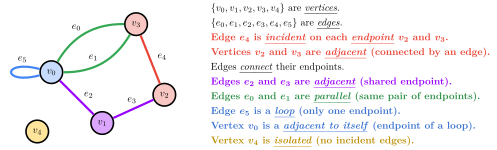
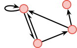
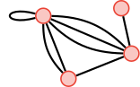
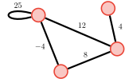
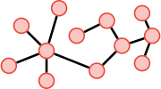
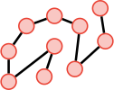

import Centered from "@components/Centered";
import HorizontalScrollingBox from "@components/HorizontalScrollingBox";
import Latex from "@components/latex/Latex";
import Todo from "@components/Todo";

# THIS PAGE IS A VERY EARLY WORK-IN-PROGRESS.

## Basic Definitions

A graph <Latex code="G" /> consists of two finite sets: a nonempty set <Latex code="V \parens{G}" /> of *vertices*, and a set <Latex code="E \parens{G}" /> of *edges*, where each edge is associated with a set consisting of either one or two vertices called its *endpoints*.

<HorizontalScrollingBox>
<Centered>
    
</Centered>
</HorizontalScrollingBox>

Instead of <Latex code="E \parens{G}" />, a *directed graph* (or *digraph*) has a set <Latex code="D \parens{G}" /> of *directed edges*. A *mixed graph* can contain both directed and undirected edges.

A *weighted graph* has valued edges. A *multigraph* may have parallel edges. A *simple graph* has no loops or parallel edges.

<Todo>Below in order are: Directed graph, undirected multigraph, and weighted undirected graph. Is there a way to annotate captions?</Todo>

<Centered>
    
    
    
</Centered>

A *list* is a graph with only one *path*. A *tree* is a graph with exactly one path between each pair of vertices.

<Todo>Below in order are: A tree and a list. Is there a way to annotate captions?</Todo>

<Centered>
    

    
</Centered>

*(Many more graph variations exist, but an exhaustive list is beyond the scope of a quick reviewer.)*

A *walk* is an alternating sequence of <u>adjacent</u> vertices and edges. A walk with only one vertex (and no edges) is a *trivial walk*. A *closed* walk starts and ends on the same vertex.

A *trail* is a walk with no repeated edges. A *circuit* is a closed trail with at least one edge.

A *path* is a walk with no repeated edges or vertices. A *simple circuit* is a closed path except it starts and ends on the same vertex, and has at least one edge.

<Todo>Diagram for path? Also, we should rework these walk/trail/path and related definitions.</Todo>

<Todo>Define *complete graphs* <Latex code="K_n" />. Make diagrams for them. (Epp, Page 633)</Todo>

<Todo>Define *complete bipartite graphs* <Latex code="K_{m,n}" />. Make diagrams for them. (Epp, Page 633)</Todo>

<Todo>Define *subgraph*. (Epp, Page 634)</Todo>

Two vertices are *connected* iff there is a walk between them. A graph is *connected* iff there is a walk between every pair of its vertices.

A graph <Latex code="H" /> is a *connected component* of its supergraph <Latex code="G" /> iff <Latex code="H" /> is connected, and no connected subgraph of <Latex code="G" /> is a supergraph of <Latex code="H" /> that also contains vertices and edges not in <Latex code="H" />. <Todo>Can we simplify this definition? Also, we should draw diagrams for this.</Todo>

The *degree* of a vertex (denoted <Latex code="\mathrm{deg}\parens{v}" /> for the degree of vertex <Latex code="v" />) is the number of edges incident on it, with loops counted twice. The *total degree* of a graph is the sum of the degrees of all vertices in the graph.

## Graph Representation

<Todo>this</Todo>

## More Theoretical Results

<Todo>What theoretical results are useful to include here? Should we create a separate section for stuff towards the end of the chapter that aren't quite as useful for typical algorithms problems?</Todo>

<Todo>Include *degree sum formula*: The sum of all degrees of a graph is twice the number of its edges. Corollary: the total degree of the graph is also be even. (Epp, Page 636)</Todo>

<Todo>Include *handshake lemma* (lemma of degree sum formula): There is an even number of vertices of odd degree.</Todo>

<Todo>Consider including connectedness lemmas. (Epp, Page 647)</Todo>

<Todo>K&ouml;nigsberg bridge problem: If a graph has an Euler circuit, every vertex has positive even degree. If a connected graph has positive even degree, it has an Euler circuit. If a graph has odd degree, then it has no Euler circuit. A connected graph has an Euler circuit iff every vertex has positive degree. (Epp, Page 652)</Todo>

<Todo>The corollary on Epp Page 653: There is an Euler path iff the graph is connected, the start and end vertices have odd degree, and all other vertices have even degrees.</Todo>

## More Definitions

<Todo>This is actually a temporary section and will probably not be in the final version. I'm just using it to write down some interesting definitions that might be useful later.</Todo>

<Todo>Consider adding *Euler circuit*: A circuit that contains every vertex and edge of a graph. (That is, every edge is used exactly once, but vertices can be used multiple times.)</Todo>

<Todo>Consider adding *Euler trail*: A trail that passes through every edge of a graph once, and every vertex at least once.</Todo>

## References

- *Discrete Mathematics with Applications* (<Latex code="\Nth{4}{th}" /> edition) by Susanna S. Epp, Chapter 10
    - A major resource I used to learn about graphs and write this section out. Highly recommended to go through it yourself if you're still learning.
    - I like the first sentence of the definition on page 626, so I copied it verbatim for the first sentence of [Basic Definitions](#basic-definitions).
- [**<u>Wikipedia</u>**](https://en.wikipedia.org/wiki/Graph_(discrete_mathematics))

