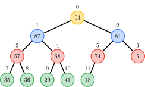
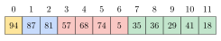

# THIS PAGE IS A VERY EARLY WORK-IN-PROGRESS.

## Introduction

A *heap* is a tree data structure where a *heap property* is fulfilled:

- For a *max-heap*, every node's value is greater than or equal to each of their immediate children.
- For a *min-heap*, every node's value is lesser than or equal to their immediate children.

A *binary heap* is a heap with the form of a binary tree that also fulfills the *shape property*, requiring the tree to also form a *complete binary tree*, meaning:

1. all levels except the last are completely filled, and
2. the last level is filled from left to right.

Heaps are commonly used to implement the <u>*priority queue*</u> ADT.

Binary heaps are commonly efficiently implemented using an array. Notably, each row appears in the array in order from left to right. Since the binary heap is a complete binary tree, the array is a compact representation with no missing nodes before the last node.

Example of a *binary max-heap* data structure (colours are used only to help show structure):

