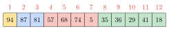

import Centered from "@components/Centered";
import DisplayLatex from "@components/latex/DisplayLatex";
import HorizontalScrollingBox from "@components/HorizontalScrollingBox";
import Eq from "@components/latex/Eq";
import Nb from "@components/Nb";
import Todo from "@components/Todo";

## Introduction

A *heap* is a tree data structure where a *heap property* is fulfilled:

- For a *max-heap*, every node's value is greater than or equal to each of their immediate children.
- For a *min-heap*, every node's value is lesser than or equal to their immediate children.

A *binary heap* is a heap with the form of a binary tree that also fulfills the *shape property*, requiring the tree to also form a *complete binary tree*, meaning:

1. all levels except the last are completely filled, and
2. the last level is filled from left to right.

Heaps are commonly used to implement the <u>*priority queue*</u> ADT.

Binary heaps are commonly efficiently implemented using an array. Notably, each row appears in the array in order from left to right. Since the binary heap is a complete binary tree, the array is a compact representation with no missing nodes before the last node.

Example of a *binary max-heap* data structure (colours are used only to help show structure):

<Centered>
    

    
</Centered>

Some common operations:

<HorizontalScrollingBox>
<Centered>
<table class="general" style="min-width: 40em;">
    <thead>
        <tr>
            <th>Operation</th>
            <th>Runtime</th>
            <th>Basic Summary</th>
        </tr>
    </thead>
    <tbody>
        <tr>
            <td><Nb><Eq code="\text{Push}\parens{\textit{item}}" /></Nb></td>
            <td><Nb><Eq code="O\parens{\log n}" /></Nb></td>
            <td>Add a single item.</td>
        </tr>
        <tr>
            <td><Nb><Eq code="\text{Pop}\parens{} \to \textit{item}" /></Nb></td>
            <td><Nb><Eq code="O\parens{\log n}" /></Nb></td>
            <td>Extract and remove the root of the heap (i.e. the <u>biggest item</u> of a max-heap, or the <u>smallest item</u> of a min-heap).</td>
        </tr>
        <tr>
            <td><Nb><Eq code="\text{Push-Pop}\parens{\textit{item}} \to \textit{item}" /></Nb></td>
            <td><Nb><Eq code="O\parens{\log n}" /></Nb></td>
            <td>Equivalent to a push and then a pop, in that order. <em>Typically more efficient than using the individual operations.</em></td>
        </tr>
        <tr>
            <td><Nb><Eq code="\text{Pop-Push}\parens{\textit{item}} \to \textit{item}" /></Nb></td>
            <td><Nb><Eq code="O\parens{\log n}" /></Nb></td>
            <td>Equivalent to a pop and then a push, in that order. <em>Typically more efficient than using the individual operations.</em></td>
        </tr>
        <tr>
            <td><Nb><Eq code="\text{Heapify}\parens{}" /></Nb></td>
            <td><Nb><Eq code="O\parens{n}" /></Nb></td>
            <td>Convert an arbitrary <em>complete binary tree</em> into a valid heap.</td>
        </tr>
        <tr>
            <td><Nb><Eq code="\text{Get-Size}\parens{} \to \textit{size}" /></Nb></td>
            <td><Nb><Eq code="O\parens{1}" /></Nb></td>
            <td>Get the number of items in the heap.</td>
        </tr>
        <tr>
            <td><Nb>(internal) <Eq code="\text{Sift-Up}\parens{\textit{node}}" /></Nb></td>
            <td><Nb><Eq code="O\parens{\log n}" /></Nb></td>
            <td>Moves a node up the tree until it is in a valid position.</td>
        </tr>
        <tr>
            <td><Nb>(internal) <Eq code="\text{Sift-Down}\parens{\textit{node}}" /></Nb></td>
            <td><Nb><Eq code="O\parens{\log n}" /></Nb></td>
            <td>Moves a node down the tree until it is in a valid position.</td>
        </tr>
    </tbody>
</table>
</Centered>
</HorizontalScrollingBox>


## Array Indexing

For <u>0-indexed arrays</u>, given an index <Eq code="i" />, we can find the indices of its left child <Eq code="c_1" />, right child <Eq code="c_2" />, and parent <Eq code="p" /> with:

<DisplayLatex code="
    c_1 = 2 i + 1
    \qquad\qquad
    c_2 = c_1 + 1
    \qquad\qquad
    p = \floor{\frac{i - 1}{2}}
" />

To quickly derive these equations, let's try using a 1-indexed array:

<Centered>
    
</Centered>

With 1-indexing, the pattern is much more obvious. Using <Eq code="i'" />, <Eq code="c'_1" />, <Eq code="c'_2" />, and <Eq code="p'" /> as our 1-indexed array indices, we observe that the following are true:

<DisplayLatex code="
    c'_1 = 2 i'
    \qquad\qquad
    c'_2 = c'_1 + 1
    \qquad\qquad
    p' = \floor{\frac{i'}{2}}
" />

To convert back to 0-indexing, we apply <Eq code="i' = i + 1" /> and such:

<DisplayLatex code="
    \begin{gathered}
        \begin{aligned}
            \parens{c_1 + 1} &= 2 \parens{i + 1} \\
            c_1 + 1 &= 2 i + 2 \\
            c_1 &= 2 i + 1
        \end{aligned}
        \qquad\qquad
        \begin{aligned}
            \parens{c_2 + \xcancel{1}} &= \parens{c_1 + \xcancel{1}} + 1 \\
            c_2 &= c_1 + 1
        \end{aligned}
        \qquad\qquad
        \begin{aligned}
            p + 1 &= \floor{\frac{i + 1}{2}} \\
            p &= \floor{\frac{i + 1 - 2}{2}}
                = \floor{\frac{i - 1}{2}}
        \end{aligned}
    \end{gathered}
" />

<Todo>Discuss left/right-shift's role in implementing array indexing.</Todo>


## Push and Sift-Up

<DisplayLatex code="
    \text{Push}\parens{\textit{item}}
    \qquad\qquad\qquad
    \text{Sift-Up}\parens{\textit{node}}
" />

The *push* operation inserts a new item into the heap. The algorithm:

1. Add the new item to the next free space while still forming a complete binary tree.
2. Run *sift-up* starting from the new node to restore the heap property.

The *sift-up* operation moves a node up the tree until it is in the correct position. The algorithm:

1. Compare the current node with its parent. If they are in the correct order, then we are done.
2. Otherwise, swap them, move to the new position of our node, and repeat *sift-up*.

Both algorithms have <Eq code="O\parens{\log n}" /> runtime.

Sample implementation:

```py
def hpush(heap, item):
    heap.append(item)
    sift_up(heap, len(heap) - 1)

def sift_up(heap, i):
    parent = (i - 1) >> 1
    if (i == 0) or (heap[parent] > heap[i]):
        return
    (heap[parent], heap[i]) = (heap[i], heap[parent])
    sift_up(heap, parent)
```

Sample driver code:

```py
# Start with a valid heap
heap = [94, 87, 81, 57, 68, 74, 5, 35, 36, 29, 41, 18]

# We push 92 to the heap
hpush(heap, 92)
print(heap) # [94, 87, 92, 57, 68, 81, 5,
            #  35, 36, 29, 41, 18, 74]
```

<Todo>Provide a visual explainer of what's happening?</Todo>


## Pop and Sift-Down

<DisplayLatex code="
    \text{Pop}\parens{} \to \textit{item}
    \qquad\qquad\qquad
    \text{Sift-Down}\parens{\textit{node}}
" />

The *pop* operation extracts and removes the root of the heap. For a max-heap, the extracted value is the largest item, or for a min-heap, the extracted value is the smallest item. The algorithm:

1. Store the current root item. This will be returned later.
2. Move the bottom-leftmost item into the original place of root.
3. Run *sift-down* starting from the new root to restore the heap property.

The *sift-down* operation moves a node down the tree until it is in the correct position. The algorithm:

1. If our current node is in the correct order with its children, then we are done.
2. Otherwise, swap the current node and one of the children it's out-of-order with. For a max-heap, we must swap with the larger child, and for a min-heap, we must swap with the smaller child, otherwise these nodes will still be out of order.
3. Move to our node's new location, and repeat *sift-down*.

Both algorithms have <Eq code="O\parens{\log n}" /> runtime.

Sample implementation:

```py
# PRECONDITION: len(heap) > 0
def hpop(heap):
    to_return = heap[0]
    heap[0] = heap.pop()
    sift_down(heap, 0)
    return to_return

def sift_down(heap, i):
    left = (i << 1) + 1
    if left >= len(heap):
        return
    right = left + 1

    if (right >= len(heap)) or (heap[left] > heap[right]):
        next_child = left
    else:
        next_child = right

    if heap[next_child] <= heap[i]:
        return
    (heap[next_child], heap[i]) = (heap[i], heap[next_child])
    sift_down(heap, next_child)
```

Sample driver code:

```py
# Start with a valid heap
heap = [94, 87, 81, 57, 68, 74, 5, 35, 36, 29, 41, 18]

result = hpop(heap)
print(result) # 94
print(heap) # [87, 68, 81, 57, 41, 74, 5, 35, 36, 29, 18]
```


## Push-Pop and Pop-Push

<DisplayLatex code="
    \text{Push-Pop}\parens{\textit{item}} \to \textit{item}
    \qquad\qquad\qquad
    \text{Pop-Push}\parens{\textit{item}} \to \textit{item}
" />

The *push-pop* operation is equivalent to a *push* and then a *pop*, in that order. The algorithm:

1. If our new item is greater than or equal to the current root (for a max-heap) or less than or equal to the current root (for a min-heap), then we are done. No need to do any further operations on the heap. The new item is also the popped item.
2. Store the current root. This will be returned later.
3. Replace the root node with the new item.
4. Perform *sift-down* starting from the root node.

The *pop-push* operation is the other way around (a *pop* followed by a *push*). The algorithm:

1. Store the current root. This will be returned later.
2. Replace the root node with the new item.
3. Perform *sift-down* starting from the root node.

*Push-pop* and *pop-push* are typically more efficient than using the individual *push* and *pop* operations together. Both operations have <Eq code="O\parens{\log n}" /> runtime.

Sample implementation and driver code for *push-pop*:

```py
# PRECONDITION: len(heap) > 0
def hpushpop(heap, item):
    if item < heap[0]:
        (item, heap[0]) = (heap[0], item)
        sift_down(heap, 0)
    return item

# sift_down is defined elsewhere.

# A valid heap
template = [94, 87, 81, 57, 68, 74, 5, 35, 36, 29, 41, 18]

heap = template.copy()
result = hpushpop(heap, 37)
print(result) # 94
print(heap) # [87, 68, 81, 57, 41, 74, 5, 35, 36, 29, 37, 18]

heap = template.copy()
result = hpushpop(heap, 95)
print(result) # 95
print(heap) # [94, 87, 81, 57, 68, 74, 5, 35, 36, 29, 41, 18]
```

Sample implementation and driver code for *pop-push*:

```py
# PRECONDITION: len(heap) > 0
def hpoppush(heap, item):
    (item, heap[0]) = (heap[0], item)
    sift_down(heap, 0)
    return item


# sift_down is defined elsewhere.

# The same valid heap as the push-pop example
template = [94, 87, 81, 57, 68, 74, 5, 35, 36, 29, 41, 18]

heap = template.copy()
result = hpoppush(heap, 37)
print(result) # 94
print(heap) # Same as for hpushpop(heap, 37)


heap = template.copy()
result = hpoppush(heap, 95)
print(result) # 94
print(heap) # [95, 87, 81, 57, 68, 74, 5, 35, 36, 29, 41, 18]
```

<Todo>Provide a visual explainer of what's happening?</Todo>


## Heapify

<DisplayLatex code="
    \text{Heapify}\parens{}
" />

The *heapify* operation converts an arbitrary *complete binary tree* into a valid heap. The algorithm simply runs *sift-down* on array nodes <Eq code="\brackets{\floor{n / 2}, \dots, 1, 0}" />, in that order.

This algorithm runs in <Eq code="O\parens{n}" />.

Sample implementation:

```py
def heapify(heap):
    for i in range(len(heap) >> 1, 0, -1):
        sift_down(heap, i - 1)
```

Sample driver code:

```py
# Start with an arbitrary complete binary tree
heap = [18, 35, 74, 36, 29, 81, 5, 57, 87, 68, 41, 94]

heapify(heap)
print(heap) # [94, 87, 81, 57, 68, 74, 5, 35, 36, 29, 41, 18]
```

<p><Todo>Provide a visual explainer of what's happening?</Todo></p>

<p><Todo>Explain the naive algorithm of repeated push operations, and another alternative algorithm that uses sift-up. Explain why sift-down is the best algorithm.</Todo></p>


## Further Reading

<p><Todo>Reference heap sort</Todo></p>

<p><Todo>Standard implementations?</Todo></p>


## References

- [**Wikipedia: Heap (data structure)**](https://en.wikipedia.org/wiki/Heap_(data_structure)): The worded definition was taken from here.
- [**Wikipedia: Binary Heap**](https://en.wikipedia.org/wiki/Binary_heap): Algorithms were taken from here.

